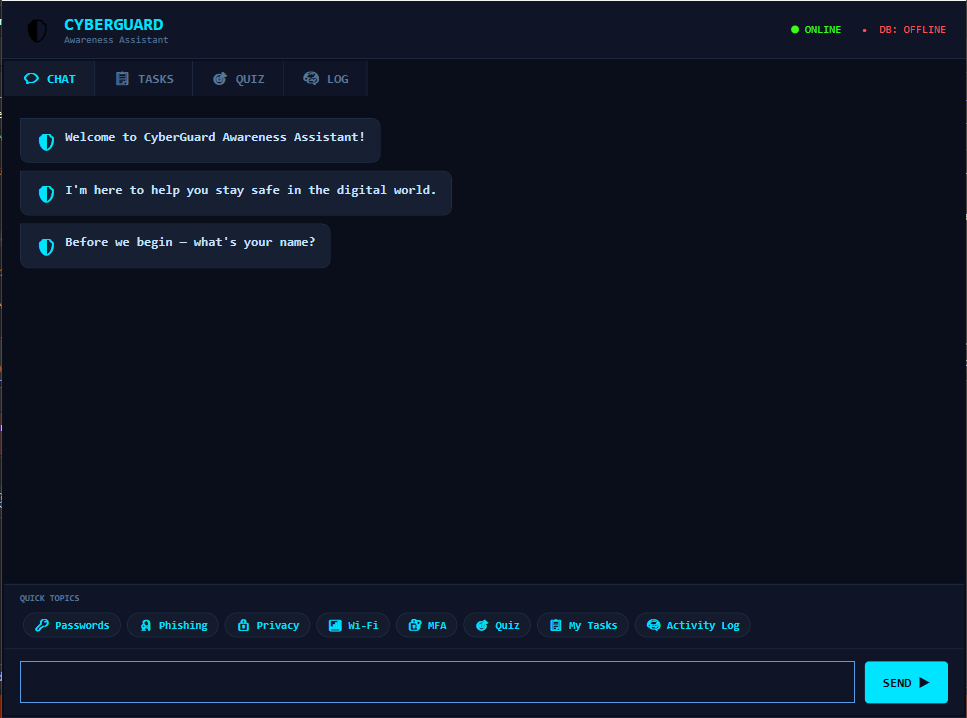
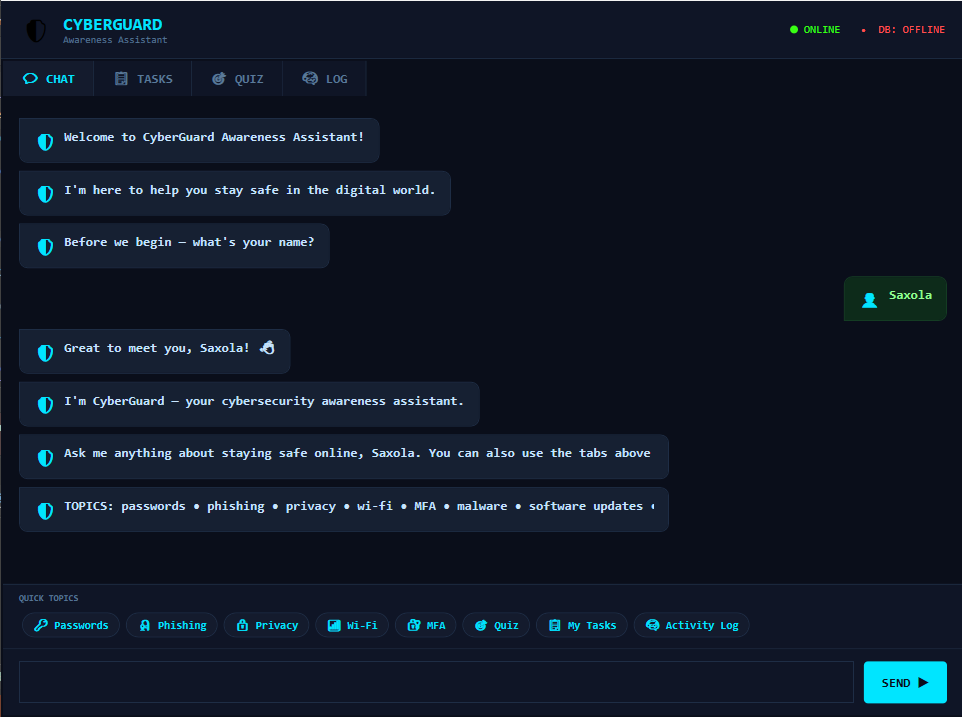

# CyberGuard — Cybersecurity Awareness Chatbot

A WPF desktop chatbot built to help South African citizens identify and protect themselves against common cyber threats including phishing, scams, weak passwords, and unsafe browsing habits.

---

## Screenshots

> Launch screen with ASCII art logo and voice greeting


> Launch screen with ASCII art logo and voice greeting



> Chat interface showing responses 



> Chat interface showing keyword recognition and sentiment-aware responses

---

## Features

- **Voice greeting** — plays a recorded WAV welcome message on launch
- **ASCII art banner** — converts a PNG logo to ASCII art displayed in the GUI header
- **Personalised conversation** — asks for the user's name and uses it throughout the session
- **Keyword recognition** — detects 10+ cybersecurity topics including passwords, phishing, privacy, Wi-Fi, MFA, malware, ransomware, software updates, and safe browsing
- **Random responses** — each topic has 5–6 varied responses selected randomly to keep conversations engaging
- **Sentiment detection** — detects emotional tone (worried, frustrated, curious, angry, positive) and responds empathetically, automatically providing a relevant tip without requiring a follow-up prompt
- **Memory and recall** — remembers the user's stated interest and references it in later responses
- **Conversation flow** — handles follow-up phrases like "tell me more", "another tip", and "continue" without resetting the conversation
- **Quick topic chips** — clickable buttons for fast access to common topics
- **Graceful error handling** — unrecognised inputs return a helpful default response; no crashes

---

## Tech Stack

- **Language:** C#
- **Framework:** WPF (.NET 8, Windows)
- **Audio:** `System.Media.SoundPlayer` for WAV playback
- **Image processing:** `System.Drawing.Bitmap` for PNG-to-ASCII conversion
- **Data structures:** `Dictionary<string, List<string>>` for keyword response banks
- **Patterns used:** Action delegate for UI-decoupled output, threading for non-blocking audio

---

## What I Learned

Building this project forced me to properly separate concerns between the UI layer and the logic layer — the `ChatBot` class has no knowledge of WPF at all, it just calls a delegate, which made it straightforward to test and extend. I also got hands-on experience with WPF layout using Grid, Border, and StackPanel to build dynamic chat bubbles in code-behind rather than static XAML, which gave me a much clearer understanding of how WPF renders UI at runtime. The sentiment detection and conversation memory features taught me how to maintain state across multiple method calls in a way that felt natural to the user.

---

## How to Run

```bash
git clone https://github.com/yourusername/cyber-security-awareness-chatbot.git
cd cyber-security-awareness-chatbot
```

1. Open the solution file (`Cyber_Security_Awareness_Chatbot.sln`) in **Visual Studio 2022** or later
2. Ensure **.NET 8 SDK** is installed — [download here](https://dotnet.microsoft.com/en-us/download/dotnet/8.0)
3. Right-click the project → **Properties** → confirm Target Framework is `net8.0-windows`
4. Make sure `greetings.wav.wav` and `logo.png` are set to **Copy to Output Directory → Copy if newer** in their file properties
5. Press **F5** to build and run

> **Note:** The voice greeting requires a Windows environment. The ASCII art banner will fall back to an embedded block-character logo if `logo.png` is not found.

---

## Project Structure

```
Cyber_Security_Awareness_Chatbot/
├── App.xaml                  # Application entry point, sets StartupUri
├── App.xaml.cs               # Partial class for Application
├── MainWindow.xaml           # Full WPF GUI layout — header, chat area, input, chips
├── MainWindow.xaml.cs        # Code-behind — event handlers, bubble rendering, flow control
├── ChatBot.cs                # All chatbot logic — keywords, sentiment, memory, responses
├── GreetingManager.cs        # WAV playback and PNG-to-ASCII image conversion
├── UserInputManager.cs       # Name input validation
├── AssemblyInfo.cs           # WPF theme configuration
├── greetings.wav.wav         # Voice greeting audio file
└── logo.png                  # Logo image converted to ASCII art on launch
```

---


## Project Context

Built as part of **Programming 2B (PROG6221)** at **Emeris, formerly Varsity College (IIE)** — individual project.

The project was developed across three parts:
- **Part 1:** Console-based chatbot with voice greeting and ASCII art
- **Part 2:** Full WPF GUI with keyword recognition, sentiment detection, memory, and conversation flow
- **Part 3 / POE:** Extended GUI with additional interactive features

---

## Future Improvements

- Add a cybersecurity quiz/game mode for interactive learning
- Integrate a task list for users to track their security hygiene steps
- Expand keyword recognition with NLP-style fuzzy matching
- Add dark/light theme toggle
- Support for additional South African languages (isiZulu, Afrikaans)
- Persist user session data between launches using local storage